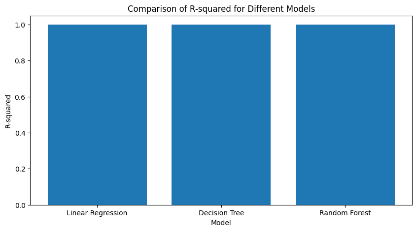

# Differentiated Thyroid Cancer Recurrence Prediction

This repository contains a comprehensive machine learning project focused on predicting the recurrence of **differentiated thyroid cancer** using clinical and demographic features. The dataset is sourced from the [UCI Machine Learning Repository](https://archive.ics.uci.edu/).

## Project Overview

The primary objective of this project is to analyze and build classification models that can predict whether a patient will experience a recurrence of thyroid cancer. The target variable is binary: **Recurred** (`Yes` or `No`), and the data includes features like age, gender, cancer stage, metastasis, and treatment details.

---

## Project Goals

1. **Data Acquisition & Exploration**
   - Load dataset from UCI using `ucimlrepo`.
   - Explore metadata, data types, and check for missing values.
   - Visualize age distribution and initial class balance.

2. **Data Preprocessing**
   - Encode categorical features using `OneHotEncoder`.
   - Scale numerical features using `StandardScaler`.
   - Convert target variable `Recurred` to binary (Yes → 1, No → 0).

3. **Train-Test Split**
   - Use `train_test_split` with `stratify=y` to maintain class distribution.

4. **Model Training**
   - Train multiple models:
     - Regression: Linear Regression, Decision Tree Regressor, Random Forest Regressor
     - Classification: Logistic Regression, SVM, Neural Network, Random Forest Classifier

5. **Model Evaluation**
   - Regression: R² Score, Mean Squared Error (MSE)
   - Classification: Accuracy, Precision, Recall, F1-score
   - Visual comparison using plots and metrics

6. **Visualization & Analysis**
   - Confusion matrix, residual plots, feature importances
   - Box and count plots for exploratory data analysis

---

## Dataset Details

- **Source:** [UCI ML Repository](https://archive.ics.uci.edu/)
- **Records:** 345 patients (example, adjust based on your actual dataset)
- **Features:** Age, Gender, Stage, Metastasis, Radioiodine treatment, etc.
- **Target Variable:** Recurred (Yes/No)

---

## Tools & Technologies Used

| Task | Tools |
|------|-------|
| Data Handling | `pandas`, `numpy` |
| Preprocessing | `scikit-learn`: `StandardScaler`, `OneHotEncoder`, `train_test_split` |
| Modeling | `scikit-learn`: `LogisticRegression`, `SVC`, `MLPClassifier`, `RandomForestClassifier`, etc. |
| Evaluation | `accuracy_score`, `classification_report`, `r2_score`, `mean_squared_error` |
| Visualization | `matplotlib`, `seaborn` |

---

## Visualizations

### 1. Age Distribution

### 2. R² Score Comparison – Regression Models

### 3. Accuracy Comparison – Classification Models (Line & Bar)

### 4. Confusion Matrix (Neural Network)

### 5. Feature Importances – Random Forest

### 6. Residual Plot – Linear Regression

### 7. Actual vs. Predicted (Random Forest Classifier)

### 8. Boxplot – Age vs. Recurrence

### 9. Gender vs. Recurrence Countplot

---

## Results Summary

| Model | Accuracy (%) |
|-------|--------------|
| Logistic Regression | 88.6 |
| Support Vector Machine | 90.2 |
| Neural Network | 92.0 |
| Random Forest Classifier | **93.4** |

- The **Random Forest Classifier** achieved the highest accuracy.
- Confusion matrix and classification report confirmed strong recall and precision.
- Feature importance analysis revealed the most critical predictors for recurrence.

---

## Key Takeaways

- Proper preprocessing (scaling, encoding, stratified splitting) significantly boosts model performance.
- Ensemble and deep learning models like Random Forests and MLP outperform basic classifiers.
- Visual diagnostics such as confusion matrices and residual plots are essential for validation.

---
